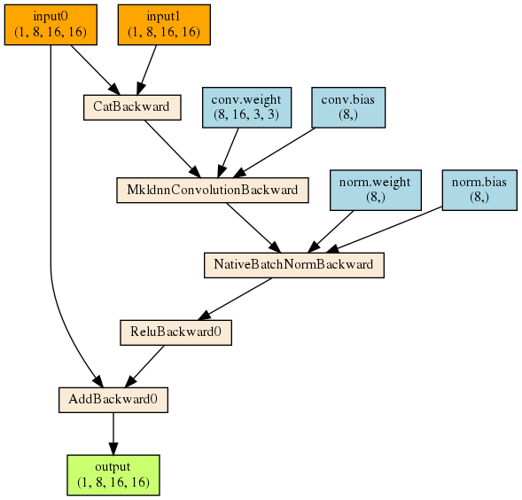

# pytorchviz

Create visualizations of PyTorch execution graphs. This package is modified from [torchviz](https://github.com/szagoruyko/pytorchviz).

## Installation

* Install `graphviz` from the package manager such as `yum` and `apt`.

* Install this package:
    ```bash
    pip install git+https://github.com/shuohan/pytorchviz
    ```

## Usage

```python
import torch

class DoubleInputModel(torch.nn.Module):
    def __init__(self):
        super().__init__()
        self.conv = torch.nn.Conv2d(16, 8, 3, padding=1)
        self.norm = torch.nn.BatchNorm2d(8)
        self.activ = torch.nn.ReLU()
    def forward(self, x1, x2):
        x = torch.cat((x1, x2), dim=1)
        out = self.conv(x)
        out = self.norm(out)
        out = self.activ(out)
        out = out + x1
        return out

di = DoubleInputModel()
x1 = torch.randn(1, 8, 16, 16)
x2 = torch.randn(1, 8, 16, 16)
dot = make_dot((x1, x2), di)
```

Example output:


